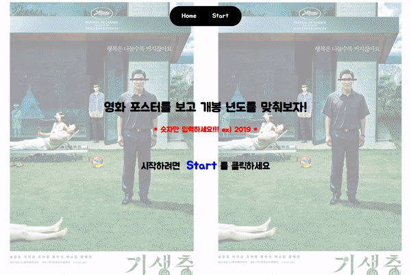

# movie_game

- https://zeroaan.github.io/movie_game/
- 기간 : 20년 9월 20일 ~ 9월 23일
- 소개 : 영화 포스터를 보고 영화 개봉년도를 맞추는 게임

<br>



<br>

#### Movie Data

- 네이버 API를 가져와 랜덤으로 영화 포스터를 보여주려 했으나 네이버 API는 검색 query를 필수로 입력해야하기 때문에 이 프로젝트와는 목적이 맞지 않았다.
- 외국 사이트의 영화 API를 가져와 사용해봤지만 외국 사이트다보니 모르는 영화가 너무 많아 게임 진행이 되지 않았다.
- moviesData.json 이라는 파일을 만들어 직접 title, year, poster를 입력해주었다.

```javascript
// 약 70개의 영화
{
    "id": 70,
    "title": "더킹",
    "year": 2017,
    "poster": "https://movie-phinf.pstatic.net/20170118_172/1484704779507T3ahF_JPEG/movie_image.jpg"
  },

  // ...
  // ...
  // ...

  {
    "id": 1,
    "title": "기생충",
    "year": 2019,
    "poster": "https://movie-phinf.pstatic.net/20190528_36/1559024198386YVTEw_JPEG/movie_image.jpg"
  }
```

<br>

#### App.js

- Router를 이용하여 home과 movies로 만들어주었다.

```jsx
const App = () => {
  return (
    <div className="App">
      <div className="nav">
        <NavLink to="/" exact={true}>
          Home
        </NavLink>
        <NavLink to="/movies">Start</NavLink>
      </div>
      <Switch>
        <Route path="/" exact={true} component={Home} />
        <Route path="/movies" component={Movies} />
        <Route component={isNotFound} />
      </Switch>
    </div>
  );
};
```

<br>

#### Movies.js

- shuffle 함수를 만들어서 moviesData에 있는 영화들을 랜덤으로 가져올 수 있도록 하였다.

```javascript
const shuffle = (array) => {
  for (let i = array.length - 1; i > 0; i--) {
    const j = Math.floor(Math.random() * (i + 1));
    [array[i], array[j]] = [array[j], array[i]];
  }
  return array;
};
```

<br>

- 영화를 맞췄을 때와 틀렸을 때를 구분하기 위해서 incorrect state를 만들어 주었으며 false일 때는 게임진행, true일 때는 재도전화면이 보이게 만들었다.

```jsx
let mode = null;
if (incorrect === false) {
  mode = (
    <div>
      <h1 className="title">{movie.title}</h1>
      <div className="movie__box">
        
        <form className="movie__form">
          <input
            className="movie__year__input"
            type="text"
            value={value}
            placeholder="개봉년도 입력 (숫자만 입력)"
            onChange={(e) => {
              setValue(e.target.value);
            }}
          />
          <input
            className="movie__year__button"
            type="submit"
            value="확인"
            onClick={(e) => {
              e.preventDefault();
              if (Number(value) === movie.year) {
                setCount(count + 1);
                if (highscore <= count) {
                  setHighscore(count + 1);
                }
                setMovie(items[count]);
                setValue("");
              } else {
                setItems(shuffle(movies));
                setCurrentscore(count);
                setCount(0);
                setMovie(items[count]);
                setValue("");
                setIncorrect(true);
              }
            }}
          />
        </form>
        <h2 className="correct_count">
          맞춘 갯수: <b>{count}</b>
        </h2>
      </div>
    </div>
  );
} else {
  mode = (
    <div className="movie__incorrect">
      <h1 className="movie__wrong">틀렸습니다. 개봉년도가 맞지 않습니다.</h1>
      <h2 className="movie__count">
        맞춘 갯수: {currentscore}
        <br /> 최고 점수: {highscore}
      </h2>
      <h2 className="movie__wrongre">다시하려면 아래 버튼을 누르세요</h2>
      <input
        type="button"
        className="movie__re"
        value="다시하기"
        onClick={() => {
          setIncorrect(false);
        }}
      ></input>
    </div>
  );
}
```
